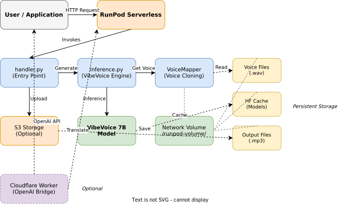

# VibeVoice RunPod Serverless

[](https://www.python.org/downloads/)
[](https://pytorch.org/)
[](https://developer.nvidia.com/cuda-toolkit)
[](https://www.runpod.io/)

> Production-ready RunPod serverless deployment of VibeVoice 7B text-to-speech model with voice cloning capabilities.

Transform text into natural-sounding speech with custom voice cloning. Deploy as a scalable serverless API on RunPod infrastructure with GPU acceleration, optional S3 storage, and OpenAI TTS API compatibility.

## ✨ Features

- **🎙️ Voice Cloning** - Clone any voice using reference audio samples (.wav format)
- **🤖 VibeVoice 7B Model** - State-of-the-art text-to-speech with natural prosody
- **⚡ Smart Text Chunking** - Automatically split long texts at natural boundaries (sentences, clauses)
- **🔊 Loudness Normalization** - Consistent audio output normalized to -20 LUFS
- **☁️ S3 Integration** - Optional S3 storage with presigned URLs, fallback to base64
- **🔌 OpenAI API Compatible** - Optional Cloudflare Worker bridge for drop-in OpenAI TTS replacement
- **🚀 Serverless Architecture** - Auto-scaling, pay-per-use deployment on RunPod
- **💾 Persistent Caching** - Network volume for models, voice files, and outputs

## 🏗️ Architecture



The system uses a three-layer architecture:

1. **Container Layer** - CUDA-enabled Docker container with Python 3.12 and PyTorch 2.8.0
2. **Handler Layer** - RunPod serverless entry point with request validation and S3 integration
3. **Inference Layer** - VibeVoice model with voice cloning and smart text chunking

All components persist on a RunPod network volume for fast subsequent startups (~30-60 seconds after first run).

## 🚀 Quick Start

### Prerequisites

- **RunPod Account** with GPU access ([Sign up](https://www.runpod.io/))
- **HuggingFace Token** with access to VibeVoice-7B ([Get token](https://huggingface.co/settings/tokens))
- **Voice Files** - At least one reference audio file in `.wav` format (3-30 seconds)

### Installation

#### 1. Deploy to RunPod

1. **Fork/Clone this repository** to your GitHub account

2. **Create RunPod Serverless Endpoint**:
   - Navigate to [RunPod Serverless](https://www.runpod.io/console/serverless)
   - Click "New Endpoint"
   - Select "From GitHub"
   - Enter your repository URL
   - Branch: `main`

3. **Attach Network Volume**:
   - Create or attach a network volume (recommended: 50GB+)
   - This persists models, cache, and voice files

4. **Configure Environment Variables**:
   ```bash
   # Required
   HF_TOKEN=your_huggingface_token_here

   # Optional - S3 Storage
   S3_ENDPOINT_URL=https://s3.amazonaws.com
   S3_ACCESS_KEY_ID=your_access_key
   S3_SECRET_ACCESS_KEY=your_secret_key
   S3_BUCKET_NAME=your_bucket_name
   S3_REGION=us-east-1

   # Optional - Tuning
   MAX_TEXT_LENGTH=2000
   DEFAULT_SAMPLE_RATE=24000
   MAX_CHUNK_CHARS=300
   DEFAULT_SPEAKER=Alice
   DEFAULT_CFG_SCALE=1.3
   ```

5. **Upload Voice Files**:
   - Connect to your network volume via RunPod SSH/SFTP
   - Upload `.wav` files to `/runpod-volume/vibevoice/demo/voices/`
   - Example: `Alice.wav`, `Carter.wav`, `Emma.wav`

6. **Deploy**:
   - Click "Deploy"
   - First run takes **2-5 minutes** (PyTorch, flash-attention, VibeVoice installation + model download)
   - Subsequent runs take **30-60 seconds** (model loading only)

#### 2. Test the Endpoint

```bash
# Replace with your actual endpoint ID and API key
curl -X POST https://api.runpod.ai/v2/{ENDPOINT_ID}/runsync \
  -H "Authorization: Bearer {RUNPOD_API_KEY}" \
  -H "Content-Type: application/json" \
  -d '{
    "input": {
      "text": "Hello! This is a test of VibeVoice text-to-speech with voice cloning.",
      "speaker_name": "Alice",
      "cfg_scale": 1.3,
      "disable_prefill": false
    }
  }'
```

**Response:**
```json
{
  "status": "success",
  "sample_rate": 24000,
  "duration_sec": 3.45,
  "audio_url": "https://presigned-s3-url.com/audio.mp3"
}
```

### Basic Usage

#### Python Example

```python
import requests
import base64

ENDPOINT_URL = "https://api.runpod.ai/v2/{ENDPOINT_ID}/runsync"
API_KEY = "your_runpod_api_key"

def generate_speech(text, speaker="Alice"):
    response = requests.post(
        ENDPOINT_URL,
        headers={
            "Authorization": f"Bearer {API_KEY}",
            "Content-Type": "application/json"
        },
        json={
            "input": {
                "text": text,
                "speaker_name": speaker,
                "cfg_scale": 1.3
            }
        }
    )

    result = response.json()

    # Download from S3 URL or decode base64
    if "audio_url" in result:
        audio_response = requests.get(result["audio_url"])
        return audio_response.content
    elif "audio_base64" in result:
        return base64.b64decode(result["audio_base64"])

    raise Exception(f"Generation failed: {result}")

# Generate speech
audio_data = generate_speech(
    "Welcome to VibeVoice! This is a demonstration of voice cloning.",
    speaker="Alice"
)

# Save to file
with open("output.mp3", "wb") as f:
    f.write(audio_data)
```

#### JavaScript Example

```javascript
const ENDPOINT_URL = "https://api.runpod.ai/v2/{ENDPOINT_ID}/runsync";
const API_KEY = "your_runpod_api_key";

async function generateSpeech(text, speaker = "Alice") {
  const response = await fetch(ENDPOINT_URL, {
    method: "POST",
    headers: {
      "Authorization": `Bearer ${API_KEY}`,
      "Content-Type": "application/json"
    },
    body: JSON.stringify({
      input: {
        text: text,
        speaker_name: speaker,
        cfg_scale: 1.3
      }
    })
  });

  const result = await response.json();

  // Return S3 URL or base64 data
  if (result.audio_url) {
    return result.audio_url;
  } else if (result.audio_base64) {
    return `data:audio/mpeg;base64,${result.audio_base64}`;
  }

  throw new Error(`Generation failed: ${JSON.stringify(result)}`);
}

// Usage
generateSpeech("Hello from VibeVoice!", "Alice")
  .then(audioUrl => console.log("Audio URL:", audioUrl))
  .catch(error => console.error("Error:", error));
```

## 📖 Documentation

### API Reference

#### Custom RunPod API

**Endpoint:** `POST https://api.runpod.ai/v2/{ENDPOINT_ID}/runsync`

**Headers:**
```
Authorization: Bearer {RUNPOD_API_KEY}
Content-Type: application/json
```

**Request Body:**
```json
{
  "input": {
    "text": "Text to synthesize",
    "speaker_name": "Alice",
    "cfg_scale": 1.3,
    "disable_prefill": false
  }
}
```

**Parameters:**

| Parameter | Type | Required | Default | Description |
|-----------|------|----------|---------|-------------|
| `text` | string | Yes | - | Text to synthesize (max 2000 chars) |
| `speaker_name` | string | No | `"Alice"` | Speaker name matching voice file in `demo/voices/` |
| `cfg_scale` | float | No | `1.3` | Classifier-free guidance scale (higher = more expressive) |
| `disable_prefill` | bool | No | `false` | Disable voice cloning (use base model voice) |

**Response:**
```json
{
  "status": "success",
  "sample_rate": 24000,
  "duration_sec": 3.45,
  "audio_url": "https://presigned-s3-url.com/audio.mp3"
}
```

Or without S3:
```json
{
  "status": "success",
  "sample_rate": 24000,
  "duration_sec": 3.45,
  "audio_base64": "base64-encoded-audio-data"
}
```

#### OpenAI TTS API (via Cloudflare Worker)

For OpenAI API compatibility, deploy the optional Cloudflare Worker bridge:

**Endpoint:** `POST https://your-worker.workers.dev/v1/audio/speech`

**Request:**
```json
{
  "model": "tts-1",
  "input": "Hello! This is a test.",
  "voice": "alloy"
}
```

**Voice Mappings:**
- `alloy` → Alice
- `echo` → Carter
- `fable` → Frank
- `onyx` → Mary
- `nova` → Maya
- `shimmer` → Samuel

See [`bridge/README.md`](bridge/README.md) for deployment instructions.

### Configuration

Environment variables for tuning:

| Variable | Description | Default |
|----------|-------------|---------|
| `HF_TOKEN` | HuggingFace authentication token | **Required** |
| `S3_ENDPOINT_URL` | S3-compatible endpoint URL | None |
| `S3_ACCESS_KEY_ID` | S3 access key ID | None |
| `S3_SECRET_ACCESS_KEY` | S3 secret access key | None |
| `S3_BUCKET_NAME` | S3 bucket name | None |
| `S3_REGION` | S3 region | `us-east-1` |
| `MAX_TEXT_LENGTH` | Maximum text length | `2000` |
| `DEFAULT_SAMPLE_RATE` | Audio sample rate (Hz) | `24000` |
| `MAX_CHUNK_CHARS` | Maximum characters per chunk | `300` |
| `DEFAULT_SPEAKER` | Default voice name | `Alice` |
| `DEFAULT_CFG_SCALE` | Default CFG scale | `1.3` |

### Voice Files

Voice cloning requires reference audio in `.wav` format:

- **Location:** `/runpod-volume/vibevoice/demo/voices/`
- **Format:** `.wav` (PCM audio)
- **Duration:** 3-30 seconds recommended
- **Quality:** Clear, single speaker, minimal background noise
- **Naming:** Use descriptive names (e.g., `Alice.wav`, `Morgan_Freeman.wav`)

**Example directory:**
```
/runpod-volume/vibevoice/demo/voices/
├── Alice.wav
├── Carter.wav
├── Emma.wav
├── Frank.wav
└── Morgan_Freeman.wav
```

## 🔧 Development

### Local Development

**Note:** Full local testing requires GPU. The following is for code development only.

```bash
# Clone repository
git clone https://github.com/your-username/vibevoice-runpod-serverless.git
cd vibevoice-runpod-serverless

# Build Docker image
docker build -t vibevoice-runpod .

# Run container (requires GPU and network volume mount)
docker run --gpus all \
  -v /path/to/volume:/runpod-volume \
  -e HF_TOKEN=your_token \
  vibevoice-runpod
```

### Project Structure

```
vibevoice-runpod-serverless/
├── Dockerfile                 # Container definition
├── requirements.txt           # Python dependencies
├── bootstrap.sh              # Runtime setup script
├── handler.py                # RunPod serverless entry point
├── inference.py              # VibeVoice inference engine
├── config.py                 # Configuration management
├── bridge/                   # Optional Cloudflare Worker
│   ├── worker.js            # OpenAI TTS API bridge
│   ├── wrangler.toml.example
│   └── voices.json          # Voice name mappings
└── docs/
    └── diagrams/            # Architecture diagrams
```

### Key Components

- **`handler.py`** - RunPod serverless handler with S3 upload, loudness normalization
- **`inference.py`** - VibeVoice model loading, voice cloning, smart text chunking
- **`config.py`** - Environment variable configuration
- **`bootstrap.sh`** - First-run setup (venv, model download, dependencies)

## 🧪 Testing

### Manual Testing

```bash
# Test with curl
curl -X POST https://api.runpod.ai/v2/{ENDPOINT_ID}/runsync \
  -H "Authorization: Bearer {RUNPOD_API_KEY}" \
  -H "Content-Type: application/json" \
  -d '{
    "input": {
      "text": "Testing voice cloning with VibeVoice.",
      "speaker_name": "Alice"
    }
  }' | jq .
```

### Test Cases

1. **Short text generation** - Single sentence
2. **Long text chunking** - Paragraph with multiple sentences
3. **Voice cloning** - Custom speaker name
4. **Error handling** - Empty text, invalid cfg_scale
5. **S3 upload** - Verify presigned URL works
6. **Base64 fallback** - Test without S3 credentials

## 🚨 Troubleshooting

### Common Issues

**1. First run timeout**
- **Symptom:** Request times out on first deployment
- **Solution:** First run takes 2-5 minutes for installation and model download. Increase RunPod timeout if needed.

**2. Model download fails**
- **Symptom:** Error: "Failed to download model"
- **Solution:** Verify `HF_TOKEN` is set and has access to VibeVoice-7B model.

**3. Voice file not found**
- **Symptom:** Error: "No voice files found"
- **Solution:** Upload at least one `.wav` file to `/runpod-volume/vibevoice/demo/voices/`

**4. Flash attention**
- **Status:** Flash-attention 2 is automatically installed for optimal performance
- **Fallback:** If flash_attention_2 fails, system automatically falls back to sdpa (slightly slower but still functional)

**5. S3 upload fails**
- **Symptom:** Audio returns as base64 instead of URL
- **Solution:** Check S3 credentials and bucket configuration. Base64 fallback works automatically.

### Debug Commands

```bash
# Check RunPod logs in dashboard
# View "Logs" tab for your endpoint

# Verify voice files exist (via SSH to network volume)
ls -la /runpod-volume/vibevoice/demo/voices/

# Check first run flag
ls -la /runpod-volume/vibevoice/.first_run_complete

# View cached model
ls -la /runpod-volume/vibevoice/hf_cache/

# Check generated outputs
ls -la /runpod-volume/vibevoice/output/
```

## 🤝 Contributing

Contributions are welcome! This project follows standard open-source contribution practices.

### How to Contribute

1. **Fork the repository**
2. **Create a feature branch** (`git checkout -b feature/amazing-feature`)
3. **Make your changes** with clear, descriptive commits
4. **Test thoroughly** - Ensure no regressions
5. **Push to your fork** (`git push origin feature/amazing-feature`)
6. **Open a Pull Request** with a detailed description

### Code Style

- **Python:** PEP 8 with type hints, Google-style docstrings
- **Logging:** Use appropriate levels (info, warning, error)
- **Error Handling:** Graceful degradation with fallbacks
- **Documentation:** Update README.md for user-facing changes

## 📄 License

This project is provided as-is for deployment of the VibeVoice model.

- **VibeVoice Model:** See [VibeVoice repository](https://github.com/vibevoice-community/VibeVoice) for model license
- **Deployment Code:** Open-source deployment implementation

## 🙏 Acknowledgments

- **VibeVoice Team** - For the excellent VibeVoice 7B model ([GitHub](https://github.com/vibevoice-community/VibeVoice))
- **RunPod** - For serverless GPU infrastructure ([RunPod.io](https://www.runpod.io/))
- **HuggingFace** - For model hosting and transformers library
- **Chatterbox** - Reference implementation patterns for RunPod serverless TTS

## 📚 Additional Resources

- [VibeVoice Model Card](https://huggingface.co/vibevoice/VibeVoice-7B)
- [RunPod Documentation](https://docs.runpod.io/)
- [Implementation Guide](IMPLEMENTATION.md)
- [Architecture Details](CLAUDE.md)

---

**Questions or Issues?** Open an issue on GitHub or consult the [troubleshooting section](#-troubleshooting).
